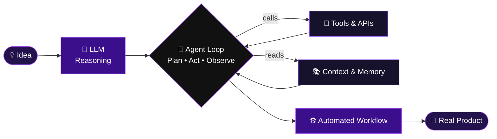
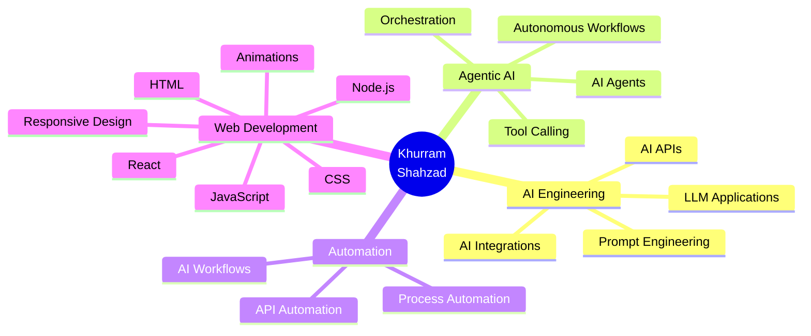
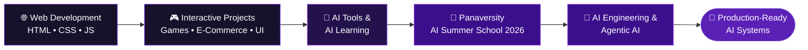

<!-- ═══════════════════════════════════════════════════════════════════ -->
<!--   KHURRAM SHAHZAD — GITHUB PROFILE README                           -->
<!--   Repo name must be exactly your username: khurramshahzadprogramer  -->
<!-- ═══════════════════════════════════════════════════════════════════ -->

<a name="top"></a>

<div align="center">


<a href="https://portfoliobyks.netlify.app/">
  
</a>

<br/><br/>


<br/><br/>

<a href="https://portfoliobyks.netlify.app/"></a>
<a href="mailto:khurramshahzad9976@gmail.com"></a>
<a href="https://wa.me/message/OSBMQ260M6XDA"></a>

<br/><br/>

<a href="#-about"><b>ABOUT</b></a> &nbsp;•&nbsp;
<a href="#-ai-blueprint"><b>AI BLUEPRINT</b></a> &nbsp;•&nbsp;
<a href="#-tech-arsenal"><b>STACK</b></a> &nbsp;•&nbsp;
<a href="#-featured-projects"><b>PROJECTS</b></a> &nbsp;•&nbsp;
<a href="#-what-i-can-build"><b>SERVICES</b></a> &nbsp;•&nbsp;
<a href="#-my-journey"><b>JOURNEY</b></a> &nbsp;•&nbsp;
<a href="#-roadmap-2026"><b>ROADMAP</b></a> &nbsp;•&nbsp;
<a href="#-github-snapshot"><b>STATS</b></a> &nbsp;•&nbsp;
<a href="#-lets-connect"><b>CONTACT</b></a>

</div>

<br/>


## 👤 About


```bash
khurram@github:~$ whoami
khurram-shahzad

khurram@github:~$ cat profile.txt
name       : Khurram Shahzad
role       : AI-Focused Developer
location   : Pakistan 🇵🇰
focus      : AI Engineering · Agentic AI · AI Automation
languages  : Python · JavaScript · HTML · CSS
learning   : LLM Apps · AI Agents · Tool Calling · APIs
mission    : Build systems where AI is the engine, not a feature
contact    : khurramshahzad9976@gmail.com
status     : 🟢 Learning • Building • Shipping
```

I'm a **young developer from Pakistan** with one clear direction: go beyond chat interfaces and build **real software systems powered by AI** — agents that reason, use tools, call APIs and complete multi-step work.

I started with **web development** (my foundation for building interfaces and products) and I'm now going deep into **AI Engineering, Agentic AI and intelligent automation**.

> [!NOTE]
> **My goal isn't just to *use* AI — it's to learn how to *build systems around it*.**

<br clear="right"/>


## 🧠 AI Blueprint

I don't treat an LLM as a chatbot. I treat it as **one component inside a bigger system**:



<div align="center">

| 🤖 AI Engineering | 🧠 Agentic AI | ⚡ Automation | 🌐 AI + Web |
|:---:|:---:|:---:|:---:|
| LLM Applications | AI Agents | AI Workflows | AI-powered Interfaces |
| AI APIs | Tool Calling | Process Automation | Modern UI/UX |
| Prompt Engineering | Orchestration | API Automation | Interactive Frontends |
| AI Integrations | Intelligent Systems | AI + Tools | Real Products |

</div>

<details>
<summary><b>🗺️ Open my skill map</b></summary>



</details>


## ⚙️ Tech Arsenal

<details open>
<summary><b>🤖 AI & Backend</b></summary>
<br/>

<div align="center">


<br/>


</div>

</details>

<details open>
<summary><b>🌐 Frontend</b></summary>
<br/>

<div align="center">


<br/>


</div>

</details>

<details open>
<summary><b>🧰 Tools & Deployment</b></summary>
<br/>

<div align="center">


</div>

</details>


## 🚀 Featured Projects

<div align="center">

<table>
<tr>

<td width="50%" align="center" valign="top">

### 🛍️ KS Outlets


A modern e-commerce experience built around product discovery, categories, shopping flow and checkout.

`E-Commerce` `UI/UX` `Product Flow` `Web Dev`

<a href="https://portfoliobyks.netlify.app/"></a>

</td>

<td width="50%" align="center" valign="top">

### 💎 Jewel Blast


An interactive browser game focused on gameplay mechanics, visual feedback and smooth interaction.

`JavaScript` `Game Logic` `Interaction` `UI`

<a href="https://portfoliobyks.netlify.app/"></a>

</td>

</tr>
<tr>

<td width="50%" align="center" valign="top">

### 🧮 Smart Calculator


A practical calculator focused on clean logic, smooth interaction and responsive presentation.

`JavaScript` `Logic` `Responsive UI`

<a href="https://portfoliobyks.netlify.app/"></a>

</td>

<td width="50%" align="center" valign="top">

### 🧠 Sequence Memory


A memory challenge built around sequence recognition, timing and user interaction.

`Game Logic` `JavaScript` `Interaction`

<a href="https://portfoliobyks.netlify.app/"></a>

</td>

</tr>
<tr>

<td width="50%" align="center" valign="top">

### ⚡ Neon Memory Challenge


A futuristic memory experience combining neon visuals, animation and challenge-based gameplay.

`Interactive UI` `Animation` `Game Logic`

<a href="https://portfoliobyks.netlify.app/"></a>

</td>

<td width="50%" align="center" valign="top">

### 🛡️ Cyber Rescue Hero


A cyber-themed interactive experience exploring futuristic interfaces and digital storytelling.

`Cyber UI` `Interaction` `Creative Web`

<a href="https://portfoliobyks.netlify.app/"></a>

</td>

</tr>
<tr>

<td width="50%" align="center" valign="top">

### 💻 Cyber Hacker


A futuristic cyber interface experiment with immersive visuals and interactive web elements.

`Web Interaction` `Cyber UI` `Creative Dev`

<a href="https://portfoliobyks.netlify.app/"></a>

</td>

<td width="50%" align="center" valign="top">

### 🤖 AI Projects


Experimenting with AI applications, agents, automation and intelligent workflows. New builds are on the way.

`AI` `Agents` `Automation` `APIs`

<a href="https://github.com/khurramshahzadprogramer?tab=repositories"></a>

</td>

</tr>
</table>

</div>


## 🛠️ What I Can Build

<div align="center">

| | What | Built with |
|:---:|:---|:---|
| 🌐 | **Responsive websites & landing pages** with modern UI/UX and smooth animations | `HTML` `CSS` `JavaScript` |
| 🛍️ | **E-commerce style front-ends** — product discovery, categories, cart & checkout flow | `JavaScript` `UI/UX` |
| 🎮 | **Interactive browser games & mini apps** with polished visual feedback | `JavaScript` `Animation` |
| 🤖 | **AI-powered experiments** — LLM API integrations, tool-based workflows, automation *(actively growing)* | `Python` `OpenAI` `Gemini` |

</div>

> [!TIP]
> Have an idea, a small project or something you'd like to learn and build together? **[Message me](mailto:khurramshahzad9976@gmail.com)** — I'm always up for it.


## 🧭 My Journey




## 🎯 Currently

<div align="center">

| | Status |
|:---:|:---|
| 🔭 | **Exploring** — AI Engineering & LLM-powered applications |
| 🌱 | **Learning** — Agentic AI, tool calling & agent orchestration |
| 🛠️ | **Building** — AI automation experiments & AI-powered web experiences |
| 🤝 | **Open to** — collaborations, ideas and learning together |

</div>

## 🗓️ Roadmap 2026

<div align="center">

| Stage | Direction | Status |
|:---:|:---|:---:|
| 1 | Strengthen AI Engineering fundamentals |  |
| 2 | Build practical AI Agents |  |
| 3 | Explore AI Automation & Workflows |  |
| 4 | Learn advanced API & tool integrations |  |
| 5 | Build intelligent AI-powered applications |  |
| 6 | Move toward production-oriented AI systems |  |

</div>


## 🏆 Achievements

<div align="center">


**Certificate of Achievement**

Successfully completed **AI Summer School 2026**, strengthening my foundation in Artificial Intelligence and emerging AI technologies.

</div>

## 💡 Principles I Build By

<div align="center">

| 🧱 Systems over demos | 🔁 Learn by building | 🚢 Ship consistently |
|:---:|:---:|:---:|
| AI should be the engine of a product, not a decoration on top of it. | Every concept I study becomes a small project or experiment. | Progress comes from steady daily work, not one big push. |

</div>


## 📊 GitHub Snapshot

<div align="center">


<br/><br/>


<br/><br/>

<a href="https://github.com/khurramshahzadprogramer?tab=repositories">
  
</a>

</div>


## 🤝 Let's Connect

<div align="center">

**Interested in AI, automation, intelligent systems — or just want to build something interesting?**

<br/>

| Platform | Best for | Link |
|:---:|:---:|:---:|
| 📧 **Email** | Projects & collaborations | <a href="mailto:khurramshahzad9976@gmail.com"></a> |
| 💬 **WhatsApp** | Quick chat | <a href="https://wa.me/message/OSBMQ260M6XDA"></a> |
| 💼 **LinkedIn** | Professional network | <a href="https://linkedin.com/in/khurramshahzad15"></a> |
| 🐙 **GitHub** | Code & projects | <a href="https://github.com/khurramshahzadprogramer"></a> |
| 📸 **Instagram** | Behind the scenes | <a href="https://instagram.com/khurram_x_rajput"></a> |
| 👍 **Facebook** | Updates | <a href="https://facebook.com/share/194Ya7pqi/"></a> |

<br/>

<a href="https://portfoliobyks.netlify.app/">
  
</a>

<br/><br/>

> **Building today. Learning every day. Engineering what's next.**

<a href="#top"></a>


</div>
